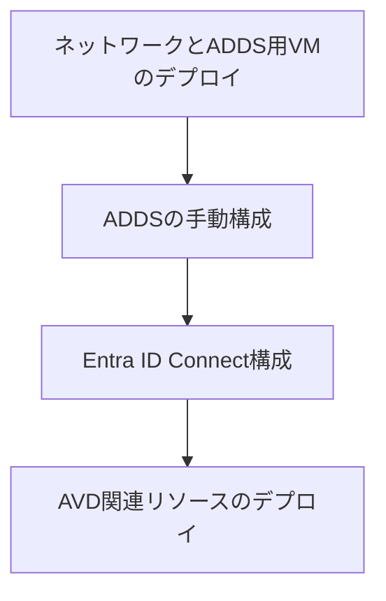

# bicep-avd-quickstarter
deploy Azure Virtual Desktop components

```mermaid
graph TD  
    A[ネットワークとADDS用VMのデプロイ]  
    B[ADDSの手動構成]  
    C[Entra ID Connect構成]  
    D[AVD関連リソースのデプロイ]  
  
    A --> B  
    B --> C  
    C --> D  
```